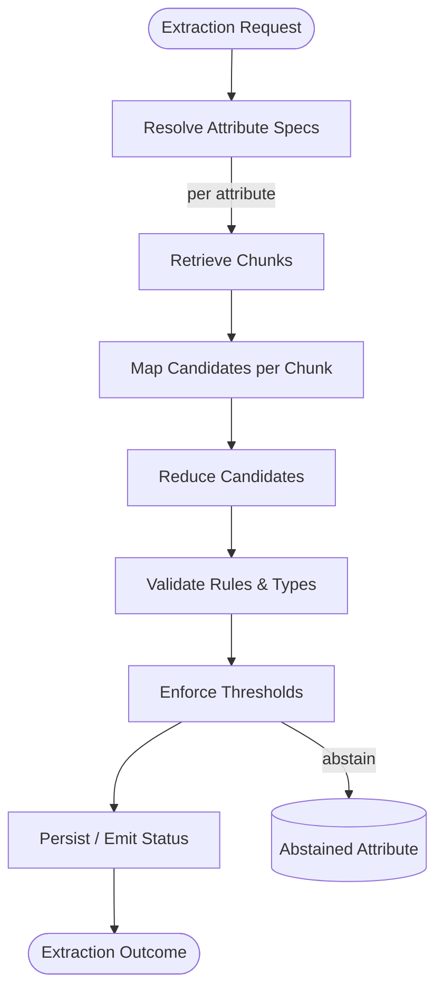

# Architecture & Deployment

Use this page when you need a guided tour of how DataSifter is wired internally, which seams are safe to customize, and how to embed the runtime inside HTTP services or background workers. It also describes the testing scaffolds that keep adapters and schemas stable.

## Layered runtime

DataSifter is intentionally split into a few stable packages:

| Layer | Location | Notes |
| --- | --- | --- |
| Graph pipeline | `src/datasifter/graph/` | Stateless helpers that orchestrate retrieval, map, reduce, validate, and threshold steps. |
| Runner glue | `src/datasifter/runner.py` | Coordinates adapters, passes context between phases, and emits progress snapshots. |
| Registries & schemas | `src/datasifter/registry/`, `src/datasifter/schemas.py` | Attribute metadata, prompts, validators, and typed models. |
| Adapters | `src/datasifter/interfaces.py` | Protocol definitions for IO boundaries (jobs, storage, retrieval, LLM, and status sinks). |

All orchestration code lives under `src/datasifter/` so deployments can mount custom adapters without having to fork or patch the runtime code.

## Extraction graph

The extraction flow is modeled as a graph so each attribute can fan out (retrieval + map per chunk) and converge (reduce + validate + persist). The runner walks this graph for every requested attribute:



- Each edge is observable via a `StatusEvent`, allowing dashboards to highlight bottlenecks.
- Because adapters implement pure protocols, you can reroute the graph for hybrid deployments (e.g., retrieve from vectors but map with a rule-engine).

## Customization points

1. **Registry overrides** – create new modules under `datasifter/registry/` to register additional attributes, prompts, and thresholds. Registries are lazy-loaded, so shipping multiple versions side-by-side is fine.
2. **Runner defaults** – `RunnerDefaults` controls base model names, retry budgets, and retrieval knobs per document type. Override on runner instantiation or via dependency injection.
3. **Phase hooks** – Provide custom `spec_resolver`, `retrieval_plan_factory`, or `status_sink` implementations when constructing `ExtractionRunner` to introduce bespoke monitoring, evaluation, or caching.
4. **Adapters** – Swap implementations without touching orchestration logic; e.g., use a lightweight SQLite job repo locally and a Postgres-backed implementation in production.

## Adapter contract highlights

Every adapter interface is a `typing.Protocol`, so static type checkers warn you if a method is missing. The runner expects the following guarantees:

| Adapter | Contract expectation |
| --- | --- |
| `JobRepository` | `prepare_job` and `update_status` must be idempotent and respect optimistic concurrency via `increment_sequence`. |
| `AttributeStore` | Persist provenance + value atomically and tolerate retries (runner may replay on failure). |
| `RetrievalProvider` | Return ordered `RetrievedChunk` objects with stable identifiers for provenance trails. |
| `MapEngine` | Return structured `Candidate` objects that reference their originating chunk and provide a rationale/confidence pair. |
| `ProgressSink` | Publish events quickly; heavy IO should be moved to background threads or queues. |

Treat the adapters like “capabilities”: once your backend implements the contracts, the rest of DataSifter behaves identically across environments.

## Sample runner configuration

You can externalize runtime defaults (model, retries, retrieval plan) in a TOML file and load it when bootstrapping the runner:

```toml
# configs/runner.toml
[defaults]
model_name = "gpt-4o-mini"
map_attempts = 3
retrieval_top_k = 12
dry_run = false

[overrides.invoice]
model_name = "gpt-4o"
retrieval_top_k = 18
threshold_min_confidence = 0.8
```

```python
from pathlib import Path
from pydantic import BaseModel
from datasifter.runner import ExtractionRunner, RunnerDefaults

class RunnerConfig(BaseModel):
    defaults: RunnerDefaults

config = RunnerConfig.model_validate_toml(Path("configs/runner.toml").read_text())
runner = ExtractionRunner(
    job_repository=my_repo,
    attribute_store=my_store,
    retrieval_provider=my_retriever,
    map_engine_factory=my_map_factory,
    progress_sink=my_progress,
    defaults=config.defaults,
)
```

Loading defaults from configuration files makes it easy to version-control runtime tweaks and keep staging/prod aligned.

## Deployment patterns

### FastAPI with streaming progress

```python
from fastapi import APIRouter, WebSocket
from datasifter.runner import ExtractionRunner
from datasifter.schemas import ExtractionRequest

router = APIRouter()

@router.post("/extract/{doc_type}")
async def extract(doc_type: str, payload: dict, runner: ExtractionRunner):
    request = ExtractionRequest(doc_type=doc_type, **payload)
    outcome = await runner.run(request)
    return outcome.result.model_dump()

@router.websocket("/progress/{job_id}")
async def progress(job_id: str, websocket: WebSocket):
    await websocket.accept()
    async for event in progress_subscriber(job_id):
        await websocket.send_json(event.model_dump())
```

- Mount the router in your FastAPI application and inject adapters via the dependency system to keep stateful resources (DB pools, HTTP clients) scoped per worker.
- Pair the HTTP endpoint with a WebSocket (or Server-Sent Events) subscriber that relays `ProgressSink` payloads so clients can render live timelines.

### Background workers & queues

```python
async def worker_loop(queue, runner: ExtractionRunner):
    async for message in queue.consume():
        request = ExtractionRequest(**message["request"])
        job = await runner.job_repository.refresh(message.get("job"))
        outcome = await runner.run(request, job=job)
        if outcome.result.status.is_failure:
            await queue.retry(message, reason=outcome.result.error or "unknown")
```

- Use a durable queue (SQS, Rabbit, Kafka) to distribute work and keep the `ExtractionRequest` payload serialized alongside the job ID.
- Store `JobState` snapshots in the queue message or fetch them from the repository to resume partially completed attributes after worker restarts.
- Combine retries with the `ExtractionOutcome` metadata; you can inspect `outcome.result.failing_attributes` to short-circuit hopeless retries.

## Testing scaffolds

### Fixtures for fake adapters

- Place reusable fakes under `tests/fixtures/` (see `tests/fixtures/fakes.py`) so every module imports the same deterministic adapters.
- Provide parametrized pytest fixtures such as `fake_runner`, `fake_progress_sink`, or `stub_map_engine` that inject known responses and keep tests fast.

```python
@pytest.fixture
def fake_map_engine():
    return StubMapEngine(responses={"total": "123.45"})
```

### Adapter contract tests

Create a shared test module that exercises the behaviors expected by `datasifter.interfaces`. Example pattern:

```python
class JobRepositoryContract:
    async def test_prepare_job_idempotent(self, repo: JobRepository):
        first = await repo.prepare_job(request, None)
        second = await repo.prepare_job(request, first)
        assert first.job_id == second.job_id
```

- Parametrize the contract with every concrete adapter to guarantee consistency (e.g., local SQLite vs. production Postgres implementations).
- Run contract tests in CI whenever a new adapter or backend driver is introduced.

### Schema regression tests

When schemas evolve, protect serialization guarantees with regression tests:

```python
def test_attribute_spec_snapshot(snapshot):
    spec = invoice_total()
    snapshot.assert_match(spec.model_dump(mode="json"))
```

- Keep stored snapshots in `tests/snapshots/` or use `pytest-regressions` to record canonical outputs for prompts, thresholds, and validators.
- Combine schema regression tests with adapter contract tests so any breaking change (e.g., renamed attribute, updated prompt ID) surfaces immediately.

Following this scaffolding keeps core guarantees intact while teams experiment with new adapters, prompts, or deployment targets.
