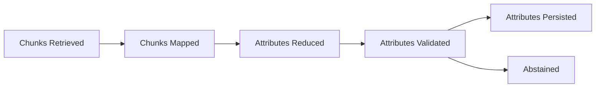

# Examples & Recipes

The snippets below show how to adapt DataSifter to different execution models. Mix and match the pieces that match your backend.

## Async API handler with streaming progress

```python
from fastapi import APIRouter, HTTPException
from datasifter.runner import ExtractionRunner
from datasifter.schemas import ExtractionRequest

router = APIRouter()

@router.post("/extract/{doc_type}")
async def extract(doc_type: str, payload: dict) -> dict:
    request = ExtractionRequest(
        job_id=payload["job_id"],
        doc_type=doc_type,
        document_uri=payload["document_uri"],
        attributes=payload.get("attributes"),
        metadata=payload.get("metadata", {}),
    )

    outcome = await runner.run(request)
    if outcome.result.status.is_failure:
        raise HTTPException(status_code=500, detail=outcome.result.error)
    return outcome.result.model_dump()
```

Pair this endpoint with a WebSocket that subscribes to your `ProgressSink` stream to show real-time status to clients.

## Batch processing with retries

```python
async def process_queue_message(message: dict) -> None:
    request = ExtractionRequest(**message["payload"])
    job = await job_repository.get_job(request.job_id)

    try:
        outcome = await runner.run(request, job=job)
    except Exception as exc:
        await dead_letter_queue.publish({"job_id": request.job_id, "error": str(exc)})
        return

    if outcome.result.status.is_failure:
        await retry_queue.enqueue(request.model_dump(mode="json"))
```

- Store the serialized `ExtractionRequest` inside your queue message, so retries remain deterministic.
- Pass the `JobState` retrieved from storage to allow resumable runs (important if a worker crashed mid-way).

## Customizing thresholds per attribute

```python
from datasifter.schemas import Thresholds
from datasifter.registry.registry import register_attribute

@register_attribute(doc_type="invoice")
def invoice_total() -> AttributeSpec:
    return AttributeSpec(
        name="total",
        label="Invoice total",
        prompts=["invoice_total:v1"],
        thresholds=Thresholds(min_confidence=0.8, min_chunks=2),
    )
```

This change immediately affects new runs because the registry is consulted at runtime. Combine it with regression tests around `datasifter.thresholds.passes_thresholds` to ensure future modifications stay safe.

## Visualizing status transitions

Use the emitted events to build dashboards. For example, you can derive a Sankey chart (progress from retrieval → map → reduce → persist) using the counters inside `ExtractionStatusPayload.snapshot.progress`.



Persist the snapshots in a time-series database to analyze how retrieval quality or LLM latency affects the rest of the pipeline.

## Testing adapters

- Use `pytest` fixtures to mock `MapEngine` responses and assert that your `AttributeStore` persists exactly once per attribute.
- When testing `RetrievalProvider`, feed deterministic documents to avoid flaky ordering; the runner assumes the order reflects ranking.
- Simulate cancellation by updating the job status to `CANCELED` between phases and ensure your adapters return promptly.
