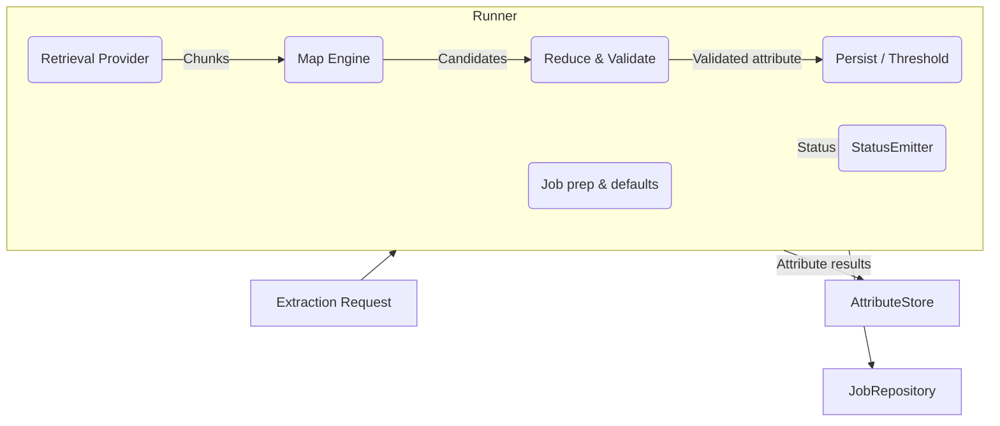

# DataSifter

DataSifter is a standalone extraction runtime that turns unstructured documents into structured attributes through a configurable retrieval-map-reduce workflow. It ships the schemas, prompts, runner, and orchestration utilities while letting any backend bring its own storage, queues, LLM providers, or UI.

## Why DataSifter exists

- **Separation of concerns** – the package focuses solely on orchestration and attribute intelligence. Your environment stays in charge of transport, persistence, security, and deployment.
- **Protocol-driven** – adapters follow lightweight `Protocol` definitions so you can wire different databases, retrieval engines, or language models without forking the core.
- **Deterministic progress** – built-in status emitters, validation helpers, and thresholding make every attribute decision auditable.
- **Registry-powered** – attribute specs, prompts, and thresholds live close to code, making versioning straightforward.

## Core building blocks

| Area | Location | Purpose |
| --- | --- | --- |
| Runner & graph | `src/datasifter/runner.py`, `src/datasifter/graph/` | Coordinates the pipeline and tracks progress. |
| Interfaces | `src/datasifter/interfaces.py` | Contracts for job repositories, retrieval, mapping engines, and progress sinks. |
| Schemas & prompts | `src/datasifter/schemas.py`, `src/datasifter/prompts.py` | Typed models for requests/results and LLM instructions. |
| Registries | `src/datasifter/registry/` | Attribute specifications, thresholds, and metadata. |
| Tools | `src/datasifter/tools/` | Helpers for reduction and validation. |

## Architecture at a glance

The `ExtractionRunner` drives this flow for every requested attribute. Each phase is observable, cancellable, and can be retried because the runner reuses the `JobRepository` state machine.

## Documentation map

- **Installation & Requirements** – prepare your environment and configure defaults.
- **Workflow Deep Dive** – understand every phase, the emitted events, and the retry model.
- **Adapters & Contracts** – learn how to implement each protocol and test integrations.
- **Examples & Recipes** – copy/paste snippets for real projects (batch jobs, async APIs, streaming progress).

Head to the [Getting Started](getting-started.md) guide when you are ready to integrate DataSifter into your backend. We'll cover requirements, local tooling commands, and a minimal runner you can adapt. For more detail on each orchestration phase, see the [Workflow Deep Dive](workflow.md).
