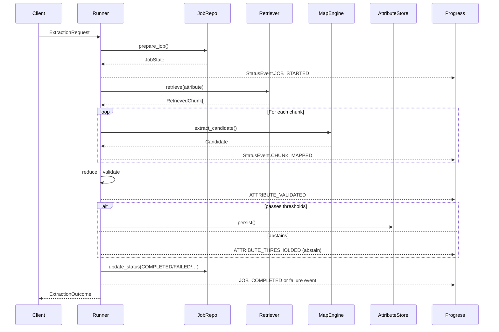

# Workflow Deep Dive

This page explains what happens when `ExtractionRunner.run()` executes, why each step exists, and how to hook into it. Use it as a mental model when debugging adapters or designing monitoring dashboards.

## Phases at a glance

| Phase | Description | Inputs | Outputs |
| --- | --- | --- | --- |
| Prepare job | Checks existing job state, seeds defaults, and guards against cancelled jobs. | `ExtractionRequest`, optional `JobState` | `JobState` |
| Resolve specs | Loads attribute metadata from the registry. | `doc_type`, attribute names | `AttributeSpec[]` |
| Retrieve chunks | Fetches contextual documents/snippets for each attribute. | `RetrievalProvider` + `RetrievalConfig` | `RetrievedChunk[]` |
| Map chunks | Calls the `MapEngine` LLM per chunk to generate candidates. | `AttributeSpec`, chunk | `Candidate[]` |
| Reduce | Aggregates multiple candidates into a single answer and provenance trail. | `Candidate[]` | Reduced aggregate |
| Validate | Applies deterministic validators (types, ranges, regex, etc.). | Aggregate, spec validators | `AttributeResult` |
| Threshold & persist | Enforces confidence thresholds, persists or abstains, emits progress. | `AttributeResult`, thresholds | Stored attribute + status events |

## Lifecycle diagram



## Detailed walkthrough

### 1. Job preparation

- `ExtractionRunner` resolves the model name/version and retrieval configuration using defaults or per-request overrides.
- `JobRepository.prepare_job()` either creates a new job row/document or resumes an existing one, ensuring idempotency across retries.
- If the job is already canceled, the runner stops early and returns an `ExtractionResult` with the cancellation reason.

### 2. Attribute specification

- `spec_resolver` (defaults to `datasifter.registry.get_attribute_specs`) fetches `AttributeSpec` definitions for the requested `doc_type`.
- Specs contain validation rules, thresholds, prompts, and canonical names, so downstream phases stay declarative.
- Unknown attributes raise `UnknownAttributeError`; the runner emits a failed result with a helpful message.

### 3. Retrieval

- The ingestion stage in `datasifter.graph.pipeline` ultimately calls your `RetrievalProvider.retrieve()` for every attribute.
- Each retrieved chunk updates `ProgressTracker.map_calls_planned` so you can estimate remaining LLM calls.
- Use the registry-provided retrieval hints (stored alongside specs) to decide whether to use OCR text, table segments, or vector search.

### 4. Mapping (LLM calls)

- The embedding stage iterates over chunks and invokes the configured `MapEngine` adapter.
- Each `Candidate` contains the proposed value, a local confidence score, rationale text, and a record of the chunk it came from.
- `StatusEmitter` publishes `StatusEvent.CHUNK_MAPPED` with the candidate metadata, allowing observers to surface intermediate clues.

### 5. Reduction

- `datasifter.tools.reduce_candidates()` merges multiple candidates, keeping the strongest answer plus a list of supporting candidates to justify the decision.
- Progress and attribute state are updated so dashboards can display the highest-confidence attribute so far.

### 6. Validation

- `datasifter.tools.apply_validation()` runs spec-level validators (regex, enums, numeric bounds) and records issues without failing the run immediately.
- Validation events include the sanitized value and any warnings; frontends can highlight incomplete data entry.

### 7. Thresholding & persistence

- Each spec has `Thresholds` (minimum confidence, required chunk count, etc.). Defaults are `min_confidence=0.65` and `min_chunks=1` when not set.
- If validation + thresholds fail, the runner produces an `abstain` result via `datasifter.thresholds.abstain_output()` so downstream systems can trigger fallbacks.
- When thresholds pass and the request is not a dry run, the `AttributeStore.persist()` adapter saves the result; otherwise, only events are emitted.
- Every attribute ends with an `ATTRIBUTE_PERSISTED` event (even for abstains) so consumers can reliably track completion.

### 8. Job finalization

- After all attributes finish, the runner updates the job status (`COMPLETED`, `FAILED`, or `CANCELED`) via `JobRepository.update_status()`.
- `StatusEvent.JOB_COMPLETED/FAILED/CANCELED` includes a snapshot: job metadata, progress counters, and the final attribute map.
- The returned `ExtractionOutcome` exposes both the latest `JobState` and a normalized `ExtractionResult` so you can forward it to HTTP callers or workers.

## Example: instrumenting progress

The progress sink receives every status event as an `ExtractionStatusPayload`. A simple logging implementation might look like:

```python
from datasifter.interfaces import ProgressSink
from datasifter.schemas import ExtractionStatusPayload

class LoggingProgressSink(ProgressSink):
    async def publish(self, payload: ExtractionStatusPayload) -> None:
        print(
            f"[{payload.job.job_id}] {payload.event} "
            f"{payload.attribute or ''} "
            f"overall={payload.snapshot.progress.attributes_done}/"
            f"{payload.snapshot.progress.total_attributes}"
        )
```

Attach this sink to the runner to get real-time feedback during testing. For production, forward these payloads to WebSockets, queues, or monitoring pipelines.

## Cancellation and retries

- Call `JobRepository.update_status(..., status=CANCELED)` from your control plane to cancel an in-flight job. The runner calls `context.ensure_active()` between critical steps to respect cancellations quickly.
- Because the job and attributes are persisted externally, you can retry the same request. The runner will see the existing job state and continue where appropriate (depending on your adapter logic).

Armed with this understanding, proceed to the [Adapters & Contracts](adapters.md) page to implement the interfaces powering each phase.
